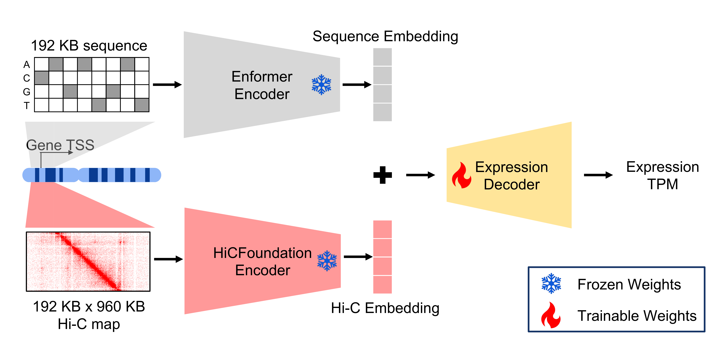

# Puget

Official implementation for the manuscript "**Puget predicts gene expression across cell types using sequence and 3D chromatin organization data**".

Puget is a deep learning framework that
predicts cell type-specific gene expression from DNA sequence and Hi-C data, which captures 3D chromatin
organization. Unlike sequence-only models, Puget explicitly models structural context to generalize effectively to unseen cell types. It pairs pre-trained sequence and Hi-C foundation model encoders with a lightweight transformer decoder.



## System Requirements
- **OS**: Linux (recommended)
- **CPU**: 4 cores or higher
- **Memory**: 64GB RAM or higher
- **GPU**: CUDA-compatible GPU with $\ge$ 24GB VRAM
- **Software**: **Git**, **Miniconda** (or **Anaconda**), and **CUDA drivers**.

## Installation
### 1. Clone the repository
```bash
git clone https://github.com/Noble-Lab/Puget.git
cd Puget
```

### 2. Set up Conda environment
This step creates a dedicated environment named ```Puget``` and installs core dependencies.
```bash
conda env create -f Puget.yml
conda activate Puget
pip install enformer-pytorch==0.8.10 --no-deps
```
Typical installation time: ~15 minutes on a Linux workstation.

## Data & Model Setup
Download the trained model checkpoints and necessary metadata from Zenodo.
```bash
# Download the combined data and model package
wget https://zenodo.org/records/17861256/files/puget_datasets_and_models.zip

# Extract the archive
# Note: This creates the 'data/' directory structure.
# Ensure you run this from the Puget repository root.
unzip puget_datasets_and_models.zip
```
Download time: ~30 minutes (varies by connection speed).

## Quick Demo
Next, verify your installation by running Puget model inference on all test genes for one of the human test biosamples, GM12878.

Run the following commands from the repository root,
```bash
# Create output directory
mkdir -p outputs/inference
# Run inference
python scripts/run_puget_inference.py --config configs/inference/human_puget_demo.yaml
```
* **Runtime:** ~16 minutes (tested on NVIDIA A5000, 24GB VRAM).

### Verification
Compare your generated predictions in `outputs/inference/puget_demo.npy` against the provided reference files:
* **Expected Prediction:** `data/example_output/GM12878_pred.npy`
* **Observed Expression:** `data/example_output/GM12878_obs.npy`

## Usage
The standard Puget workflow consists of three stages: **Data Preprocessing**, **Inference**, and **Interpretation**.

**Note: All commands below assume you are running them from the repository root** (e.g., `~/Puget/`).

### 1. Data Preprocessing
To run Puget on custom biosamples, you need to preprocess your Hi-C and sequence data into the model's expected input format. Here, we provide an example for preprocessing the data for test genes in one of the human test biosamples, **K562**.

#### Step 1: Prepare the Hi-C data
You can use either public data (e.g., from ENCODE) or in-house `.hic` files. For this example, we download the K562 Hi-C map (`ENCFF621AIY`) from ENCODE.

```bash
mkdir -p encode_data

echo "ENCFF621AIY" > data/accessions/hiclist_k562.csv

python data_preprocessing/download_hic_list.py --hiclist_path "data/accessions/hiclist_k562.csv" --output_dir "encode_data"
```
This will download the Hi-C data to `encode_data/ENCFF621AIY.hic`.

#### Step 2: Convert .hic to internal .pkl format
Use the provided utility `hic2array.py` to convert standard `.hic` files into Python pickle files containing SciPy sparse matrices.

Run the following command:
```bash
# Syntax: python data_preprocessing/hic2array.py [input.hic] [output.pkl] [resolution] [normalization] [mode]
python data_preprocessing/hic2array.py encode_data/ENCFF621AIY.hic encode_data/ENCFF621AIY.pkl 1000 0 2
```
**Understanding the Arguments:**
* `1000`: **resolution** (1 kb).
* `0`: **normalization** (`0` = NONE). Puget expects raw counts.
* `2`: **mode** (`2` = SciPy sparse matrix, intra-chromosomal contacts only). This restricts extraction to cis-contacts to optimize storage.

#### Step 3: Extract Model Inputs around the Gene Region
Generate the input windows (Hi-C maps and sequence) centered on your genes of interest.

**A. Extract Hi-C Windows**
Run the batch extraction script `run_extract_windows.sh`. This script iterates through your accession list and extracts a **192kb $\times$ 960kb** contact window centered on the TSS of every gene in your BEDPE file.

For example, to extract windows for all test genes in K562, run the following command:
```bash
mkdir -p data/example_input

# Syntax: bash run_extract_windows.sh <PKL_DIR> <BEDPE_FILE> <OUTPUT_DIR> <ACCESSION_LIST>
bash data_preprocessing/run_extract_windows.sh "encode_data" "data/gene_annotations/human_anno_tss_filtered_192k_960k_test.bedpe" "data/example_input" "data/accessions/hiclist_k562.csv"
```
* **Output:** This generates `data/example_input/ENCFF621AIY.pkl` for K562 test regions.

**B. Extract Sequence Inputs**
Extract 192kb DNA sequences from the reference genome (`.fa`) based on gene coordinates (`.bed`).

Run the following command to extract test sequences for human:
```bash
python data_preprocessing/save_seq_indices.py --bed_filepath "data/gene_annotations/human_anno_tss_filtered_192k_test.bed" --fasta_filepath "data/reference_genome/hg38.fa" --output_npy "data/example_input/humanseq_test_indices_rep.npy"
```
**Verification:**
The output file `data/example_input/humanseq_test_indices_rep.npy` should match the provided reference file `data/example_input/humanseq_test_indices.npy`.

### 2. Inference
Once the data is preprocessed, you can run inference to predict gene expression.

#### Running Puget
To predict gene expression using both DNA sequence and Hi-C contact maps, run the Puget inference script.

```bash
mkdir -p outputs/inference
# Run Puget inference on K562 test genes
python scripts/run_puget_inference.py --config configs/inference/human_puget_k562.yaml
```
* **Output:** Predictions are saved to `outputs/inference/puget_k562.npy`.

#### Running Baselines
For benchmarking purposes, the repository includes scripts to run inference using the single-modality baselines.

**Enformer (Sequence-only):**
Uses only the DNA sequence input to predict expression, ignoring chromatin structure.
```bash
# Run Enformer inference on test genes
python scripts/run_enformer_inference.py --config configs/inference/human_enformer.yaml
```
* **Output:** Predictions are saved to `outputs/inference/enformer.npy`. 
* **Note:** The sequence-only baseline only outputs predictions for the training biosamples and cannot generalize to unseen cell types. For evaluation on a test biosample (e.g. K562), we need to impute predictions using the training biosample with the highest expression similarity.

**HiCFoundation (Hi-C-only):**
Uses only the Hi-C contact map to predict expression, ignoring DNA sequence input.
```bash
# Run HiCFoundation inference on K562 test genes
python scripts/run_hicfoundation_inference.py --config configs/inference/human_hicfoundation_k562.yaml
```
* **Output:** Predictions are saved to `outputs/inference/hicfoundation_k562.npy`.

### 3. Interpretation
Puget provides tools to interpret model predictions, allowing you to understand which sequence or chromatin features contribute most to gene expression.

#### Saliency Maps
Use the [Captum package](https://captum.ai/) to generate attribution scores ([input x gradient](https://arxiv.org/abs/1605.01713)) for sequence and Hi-C inputs.

To generate attribution scores for K562 test genes, run the following command,
```bash
mkdir -p outputs/interpretation/attribution
python scripts/run_puget_attribution.py --config configs/interpretation/k562_attribution.yaml
```
* **Output:** Attribution scores (`.npy` files) are saved to `outputs/interpretation/attribution/`.

#### *In Silico* Perturbation
Predict the functional impact of inhibiting candidate enhancers on gene expression.

Curate a list of candidate enhancer locations as shown in `data/CRISPRi/CRISPRi_k562.csv`. We will *in silico* knockout the column containing the candidate enhancer locations in the Hi-C map and run inference on the perturbed and non-perturbed maps.

```bash
mkdir -p outputs/interpretation/perturbation
python scripts/run_puget_perturbation.py --config configs/interpretation/k562_perturbation.yaml
```
* **Output:** A CSV file saved inside `outputs/interpretation/perturbation` containing predicted expression for perturbed vs. non-perturbed Hi-C inputs, indicating the predicted change in gene expression following *in silico* knockout of candidate enhancers.

## Model Training
> **Note:** Most users do not need to retrain the model. The following steps are intended for users wishing to reproduce the manuscript results or train Puget on new datasets.

As described in the manuscript, we freeze the Enformer and HiCFoundation encoders and train only the lightweight decoder. For computational efficiency, we first pre-compute and save the embeddings from these encoders, and then train the decoders on the cached embeddings.

### 1. Pre-compute Embeddings & Labels
Decoder training requires generating three key datasets: gene expression labels, pre-computed sequence embeddings, and pre-computed Hi-C embeddings.

**A. Prepare Labels**
1. Download RNA-seq TSV files from ENCODE using `data_preprocessing/download_rna_list.py` with the RNA accession list (`data/accessions/rnalist_human.csv`).
2. Generate the labels using `data_preprocessing/prepare_expr_labels.py`.

**B. Prepare Sequence Embeddings**
1. Extract sequence inputs using `data_preprocessing/save_seq_indices.py` for both training genes (`data/gene_annotations/human_anno_tss_filtered_192k_train.bed`) and validation genes (`data/gene_annotations/human_anno_tss_filtered_192k_val.bed`).
2. Generate sequence embeddings from these indices using `data_preprocessing/embed_sequence.py`.

**C. Prepare Hi-C Embeddings**
1. Download Hi-C files from ENCODE using `data_preprocessing/download_hic_list.py` with the Hi-C accession list (`data/accessions/hiclist_human.csv`) and convert .hic files to .pkl files using `data_preprocessing/run_hic2pkl_list.sh`.
2. Extract Hi-C windows using `data_preprocessing/run_extract_windows.sh`. We extract windows for:
    * **Training:** Training genes (`data/gene_annotations/human_anno_tss_filtered_192k_960k_train.bedpe`) in training biosamples (`data/accessions/human_train_accessions.csv`).
    * **Validation:** Validation genes (`data/gene_annotations/human_anno_tss_filtered_192k_960k_val.bedpe`) in validation biosamples (`data/accessions/human_val_accessions.csv`).
3. Generate Hi-C embeddings from these windows using `data_preprocessing/embed_hic.py`.

> **Important:** The training configs assume outputs are saved to `processed_data/labels`, `processed_data/seq_embedding`, and `processed_data/hic_embedding`. If you save them elsewhere, please update the paths in the `.yaml` configuration files accordingly.

### 2. Train Decoders
Once labels and embeddings are generated, you can launch the training for the Puget decoder and the baseline decoders.

**A. Puget Decoder**
```bash
python scripts/run_puget_training.py --config configs/training/puget_train.yaml
```

**B. Enformer Decoder**
```bash
python scripts/run_enformer_training.py --config configs/training/enformer_train.yaml
```

**C. HiCFoundation Decoder**
```bash
python scripts/run_hicfoundation_training.py --config configs/training/hicfoundation_train.yaml
```

## How to cite
If you use Puget in your research, please cite our manuscript,

```bibtex
@article{hang2025puget,
  title={Puget predicts gene expression across cell types using sequence and 3D chromatin organization data},
  author={Hang, Shengqi and Wang, Xiao and Murtaza, Ghulam and Jha, Anupama and Wen, Bo and Fang, Tangqi and Sanders, Justin and Wang, Sheng and Noble, William Stafford},
  journal={bioRxiv},
  pages={2025--11},
  year={2025},
  publisher={Cold Spring Harbor Laboratory}
}
```
