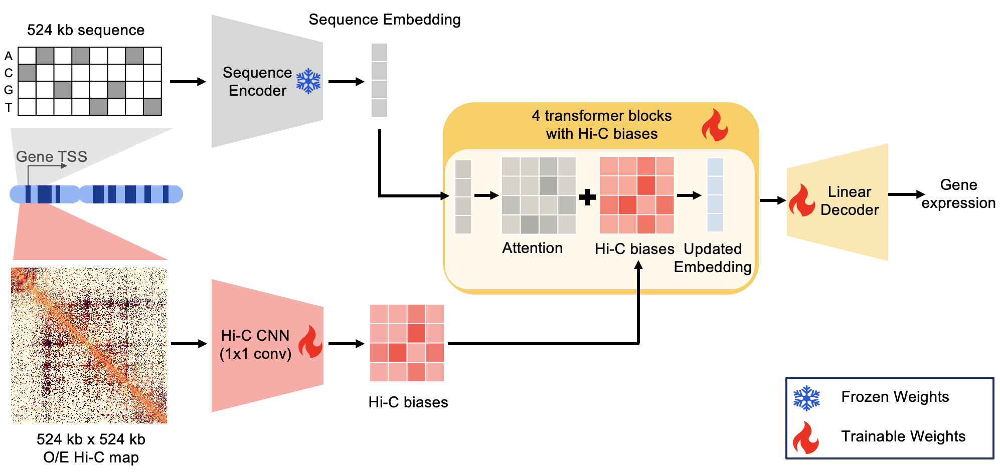

# Puget

Official implementation for the manuscript "**Puget predicts gene expression across cell types using sequence and 3D chromatin organization data**".

Puget is a deep learning framework that predicts cell type-specific gene expression from DNA sequence and Hi-C data, which captures 3D chromatin organization.



*__Figure 1. Overview of Puget.__ For each gene, Puget takes a DNA sequence and a TSS-centered observed/expected (O/E) Hi-C map. A frozen pretrained encoder embeds the sequence. A trainable pointwise Hi-C CNN turns the Hi-C map into attention biases for four transformer blocks on the sequence embeddings. A linear decoder then predicts expression as log2(TPM + 1).*

## Installation

```bash
git clone https://github.com/Noble-Lab/Puget.git
cd Puget
conda env create -f Puget.yml
conda activate Puget
```

The `Puget` environment covers preprocessing, training, inference, and
interpretation.

Sequence embeddings are generated in three separate environments, one per
pretrained encoder:

```bash
conda env create -f enformer-pytorch.yml
conda env create -f borzoi-pytorch.yml
conda env create -f alphagenome-pytorch.yml
```

The three sequence embedding environments are only used for precomputing the sequence embeddings.
Run all training, inference, and interpretation scripts under the `Puget` environment.
Run all commands below from the repository root unless stated otherwise.

## Data

Download the companion data from Zenodo
([10.5281/zenodo.23148565](https://doi.org/10.5281/zenodo.23148565)) and
extract it into `data/` at the repository root:

```bash
wget -O Puget_data.zip "https://zenodo.org/records/23148565/files/Puget_data.zip?download=1"

# Run from the repository root; files are extracted into Puget/data/
unzip Puget_data.zip
```

## Preparing model inputs

Follow [data_preprocessing/README.md](data_preprocessing/README.md) to download
the remaining public files (genome, annotation, RNA-seq, and Hi-C) and build
every model input under `outputs/`:

- gene tables, splits, and expression labels (`outputs/enformer_data/`, `outputs/borzoi_data/`);
- Enformer, Borzoi, and AlphaGenome embeddings at 1,024 bp resolution (`outputs/seq_embeddings/`);
- Raw Hi-C windows for the HiCFoundation baseline and O/E Hi-C windows for
  Puget (`outputs/hic_windows/`).

## Training

All models train on 14 cell lines and select the checkpoint with the lowest
validation MSE.
GM12878 and K562 are held out as test cell lines.

**Enformer split** (196 kb windows; 14,274 / 1,439 / 1,707 train / valid / test genes):

```bash
python scripts/train_seq_only.py --config configs/training/enformer_split_seq_only.yaml --gpu 0
python scripts/train_hic_only.py --config configs/training/enformer_split_hic_only.yaml --gpu 0
python scripts/train_puget.py    --config configs/training/enformer_split_puget.yaml --gpu 0
```

**Borzoi split** (524 kb windows; 13,768 / 1,873 / 1,690 train / valid / test genes):

```bash
python scripts/train_seq_only.py --config configs/training/borzoi_split_seq_only_borzoi.yaml --gpu 0
python scripts/train_seq_only.py --config configs/training/borzoi_split_seq_only_alphagenome.yaml --gpu 0
python scripts/train_hic_only.py --config configs/training/borzoi_split_hic_only.yaml --gpu 0
python scripts/train_puget.py    --config configs/training/borzoi_split_puget_borzoi.yaml --gpu 0
python scripts/train_puget.py    --config configs/training/borzoi_split_puget_alphagenome.yaml --gpu 0
```

`train_seq_only.py` trains the sequence-only baselines, and `train_hic_only.py`
trains the HiCFoundation (Hi-C-only) baseline.
By default, checkpoints are saved to
`outputs/enformer_split/` and `outputs/borzoi_split/`.

## Inference

Predict test-gene expression with the matching inference config for each of the
eight models:

**Enformer split**:

```bash
python scripts/infer_seq_only.py --config configs/inference/enformer_split_seq_only.yaml
python scripts/infer_hic_only.py --config configs/inference/enformer_split_hic_only.yaml
python scripts/infer_puget.py    --config configs/inference/enformer_split_puget.yaml
```

**Borzoi split**:

```bash
python scripts/infer_seq_only.py --config configs/inference/borzoi_split_seq_only_borzoi.yaml
python scripts/infer_seq_only.py --config configs/inference/borzoi_split_seq_only_alphagenome.yaml
python scripts/infer_hic_only.py --config configs/inference/borzoi_split_hic_only.yaml
python scripts/infer_puget.py    --config configs/inference/borzoi_split_puget_borzoi.yaml
python scripts/infer_puget.py    --config configs/inference/borzoi_split_puget_alphagenome.yaml
```

The inference configs load the released checkpoints in `data/trained_models/`.
Predictions are written to `outputs/{enformer,borzoi}_split_inference/`.
Hi-C-only and Puget models also predict for the two unseen cell lines,
GM12878 and K562.

## Interpreting Puget-AlphaGenome

These analyses use the released Puget-AlphaGenome checkpoint
(`data/trained_models/borzoi_split/puget_alphagenome_best.ckpt`) and the
1,690 Borzoi-split test genes.
Run `infer_puget.py` with `borzoi_split_puget_alphagenome.yaml` first; the input
ablation and loop knockout analyses read its predictions. TAD attribution also
requires the integrated gradients output.

### Integrated gradients

Build the IG baseline, then run IG attribution on the Hi-C map:

```bash
python scripts/build_ig_baseline.py
python scripts/attribute_puget_ig.py --gpu 0
```

This computes 100-step IG maps for 1,690 genes × 16 cell lines under
`outputs/borzoi_split_attribution/`.

### Input ablations

```bash
python scripts/ablate_puget_hic.py --gpu 0
```

This predicts all 16 cell lines with real Hi-C, zero Hi-C, diagonally shuffled
Hi-C, and promoter-only Hi-C (only the promoter rows and columns kept).
It writes per-cell-line and per-gene
correlation tables under `outputs/borzoi_split_ablation/puget_alphagenome/`.

### TAD attribution and loop knockout (GM12878 example)

Both analyses are shown for one cell line, GM12878, using the ENCODE Hi-C TAD and
loop calls in `data/annotations/`:

```bash
python scripts/tad_attribution_puget.py

python scripts/loop_ko_puget.py --gpu 0
```

By default, results go to
`outputs/borzoi_split_interpretation/{loop_ko,tad_attribution}/GM12878/`.
For another cell line, pass its name with `--biosample` plus its BEDPE file
(`--tads` for `tad_attribution_puget.py`, `--loops` for `loop_ko_puget.py`).

## License

This project is licensed under the Apache License 2.0; see [LICENSE](LICENSE).
